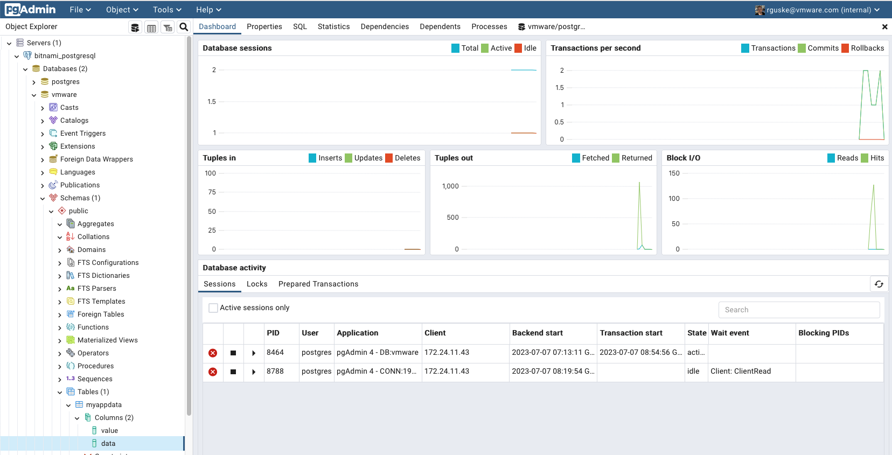

# PostgreSQL-Writer Application

This repo contains a little python application which will write data into two PostgreSQL table columns. It'll run as a Kubernetes Job.

Supporting blog post - :memo: [vSphere with Tanzu Supervisor Services Part IV - Virtual Machine Service to support Hybrid Application Architectures](https://rguske.github.io/post/vsphere-with-tanzu-supervisor-services-part-iv-virtual-machine-service-to-support-hybrid-application-architectures/)

The container image is available on Docker Hub - :whale: [rguske/postgres-writer-app](https://hub.docker.com/r/rguske/postgres-writer-app/tags)

## Create the Container Image

```shell
docker build -t rguske/postgres-writer-app:1.0 .

[+] Building 1.4s (12/12) FINISHED
 => [internal] load build definition from Dockerfile                                                                                                                                   0.0s
 => => transferring dockerfile: 553B                                                                                                                                                   0.0s
 => [internal] load .dockerignore                                                                                                                                                      0.0s
 => => transferring context: 2B                                                                                                                                                        0.0s
 => [internal] load metadata for docker.io/library/python:3.9-slim                                                                                                                     0.9s
 => [auth] library/python:pull token for registry-1.docker.io                                                                                                                          0.0s
 => [1/6] FROM docker.io/library/python:3.9-slim@sha256:1981920906ec577fb1a83bffca080ad659692688e80aee4cfe58d4642ac108e8                                                               0.0s
 => [internal] load build context                                                                                                                                                      0.0s
 => => transferring context: 2.37kB                                                                                                                                                    0.0s
 => CACHED [2/6] WORKDIR /app                                                                                                                                                          0.0s
 => CACHED [3/6] RUN apt-get update && apt-get install -y libpq-dev gcc vim wget curl                                                                                                  0.0s
 => CACHED [4/6] COPY requirements.txt .                                                                                                                                               0.0s
 => CACHED [5/6] RUN pip install --no-cache-dir -r requirements.txt                                                                                                                    0.0s
 => [6/6] COPY . .                                                                                                                                                                     0.1s
 => exporting to image                                                                                                                                                                 0.1s
 => => exporting layers                                                                                                                                                                0.1s
 => => writing image sha256:6bb4b4cfef77934dfbfb7119fd8195810074e0b9bc645c189ab3d15b5991a7c3                                                                                           0.0s
 => => naming to docker.io/rguske/postgres-writer-app:1.0
```

## Run on Kubernetes

### Create a Kubernetes Namespace

`kubectl create ns postgres-app`

### Create the Kubernetes Secret

```shell
kubectl create secret generic postgres-secret \
  --from-literal=username='postgres' \
  --from-literal=password='0yt5JR63W5I2' \
  --from-literal=host='10.105.3.50' \
  --from-literal=port='5432' \
  --from-literal=database='vmware' \
  --from-literal=table='myappdata' \
  --from-literal=column1='value' \
  --from-literal=column2='data' \
  --namespace='postgres-app'
```

### Deploy the Application as a Kubernetes Job

1. Watch the execution in a seperate window (optional)

`watch kubectl -n postgres-app get job,pod`

2. Deploy the Job manifest

`kubectl -n postgres-app apply -f postgresql-writer-job.yaml`

### Validating the written Data

We have three variants to use to validate that data was successfully written into the db table and columns.

- 1. Using `kubectl`

```shell
kubectl -n postgres-app logs jobs/postgres-writer-job -f
('John', 'Doe')
('Jane', 'Smith')
('Alice', 'Johnson')
```

- 2. Using `psql`:


```shell
psql -U postgres -h 10.105.3.50 -p 5432 -d vmware -c 'SELECT * FROM myappdata'

Password for user postgres:

 value | data
---------+---------
 John    | Doe
 Jane    | Smith
 Alice   | Johnson
(3 rows)
```

- 3. Using `pgAdmin`

Run pgadmin4 locally as conatiner.

```shell
docker run -p 80:80 \
    -e 'PGADMIN_DEFAULT_EMAIL=rguske@vmware.com' \
    -e 'PGADMIN_DEFAULT_PASSWORD=VMware1!' \
    -d dpage/pgadmin4:7.4
```



Go to **Tools** and select **Query Tool**. Enter the following `search_query` and press the play button:

`SELECT * FROM public.myappdata`
